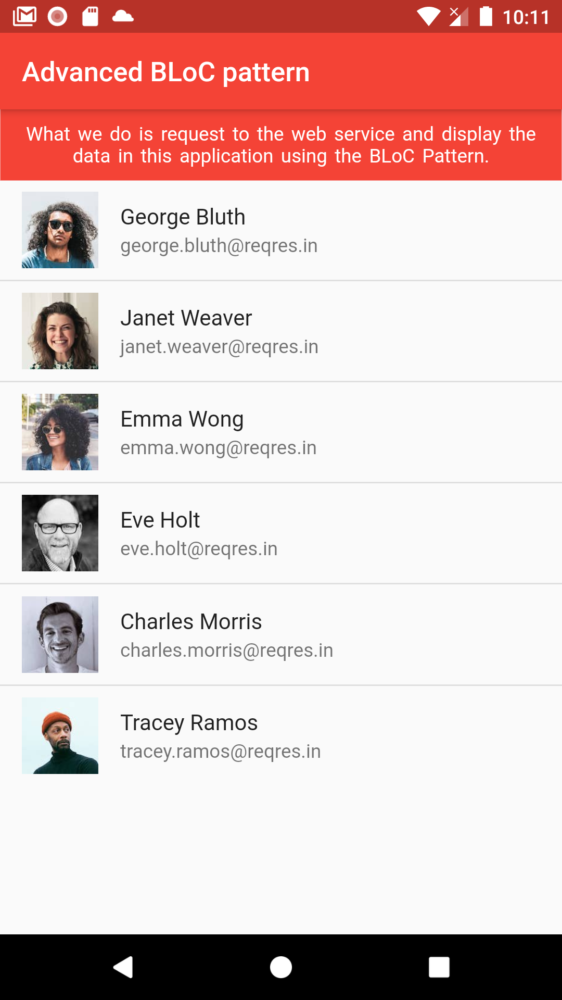

# Flutter Advanced Bloc

Flutter advanced bloc with various dependencies, let's learn with a more complex case study. What we do is, make a request to the web service using their API and display its response in this application using BLoC pattern

<b>As for the required dependency</b>

<table>
  <tr>
    <th>Name</th>
    <th>Link</th>
  </tr>
  <tr>
    <td>flutter_bloc</td>
    <td>https://pub.dev/packages/flutter_bloc</td>
  </tr>
  <tr>
    <td>dio</td>
    <td>https://pub.dev/packages/dio</td>
  </tr>  
  <tr>
    <td>dartz</td>
    <td>https://pub.dev/packages/dartz</td>
  </tr>  
  <tr>
    <td>freezed</td>
    <td>https://pub.dev/packages/freezed</td>
  </tr>
  <tr>
    <td>freezed_annotation</td>
    <td>https://pub.dev/packages/freezed_annotation</td>
  </tr>  
   <tr>
    <td>build_runner</td>
    <td>https://pub.dev/packages/build_runner</td>
  </tr>
</table>

